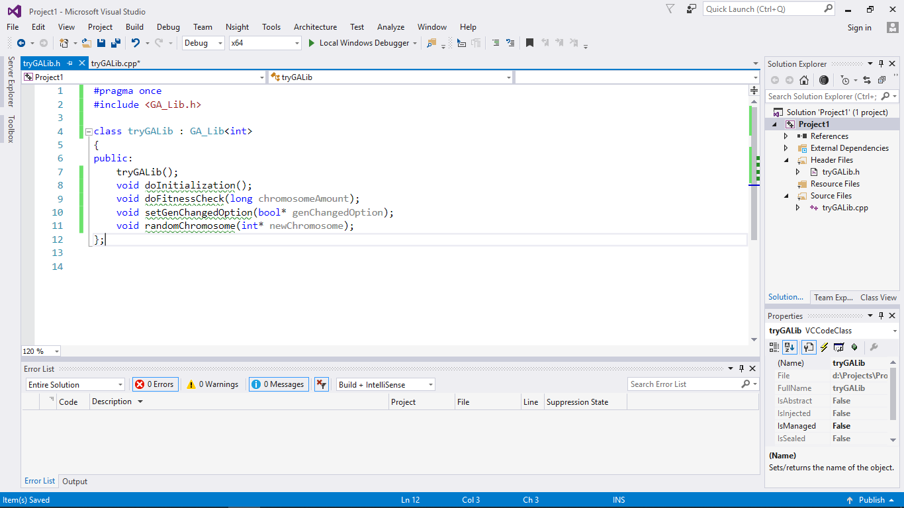

<h1 align="center"> GA_Lib and WOA_Lib </h1>
<h2 align="center"> General Purpose GA and WOA Library using CUDA C++ </h2>

About
------------
GA_Lib and WOA_Lib is C++ Library for GA (__Genetic Algorithm__) and WOA (__Whale Optimization Algorithm__) with the support of NVIDIA CUDA. 
This library can only support C++ and require user to install CUDA beforehand.

Requirements
------------
1. NVIDIA Graphics Card that is listed in CUDA Capable Hardware (See [CUDA Enabled Products](https://developer.nvidia.com/cuda-gpus)).
2. CUDA Toolkit 9.0 or more.
3. Visual Studio 2015 or more with C++.

Features
------------

* **General Metaheuristic Problem to be Solved** — Any problems that can be solved using Evolutionary Algorithms, especially metaheuristic problems, can be solved using this library. The given examples inside the library shows two of general metaheuristic problems: __Sudoku__ and __TSP__, to be solved using this library. As long as the problem can be represented into individual and the fitness can be calculated, GA_Lib and WOA_Lib are the right things to be used to solve the given problems.

* **Clean, Object-Oriented Library Design** — Object oriented shows that all things can be turned into object. GA_Lib and WOA_Lib are using clean OOP Design with implementation of abstract class to make it easier for user to implement GA and WOA on real problems.

* **Easy, Short Implementation** — It is many people wish to solve any problems using easiest method. With GA_Lib and WOA_lib, user can implement GA and WOA using the easiest means, with some simple understanding and short implementation of code. Of course, this depends on the scale of problems.

* **Fast, GPU-Programming Based Library** — Speed is an essential matters for all libraries these days. It also applies for GA_Lib and WOA_Lib. These 2 libraries are based on GPU-Programming, especially NVIDIA CUDA, to run the code. It is required things to have if user want to use these libraries.

* **Full and Complete Documentation** — GA_Lib and WOA_Lib provides full documentation of all the features inside library to be used.

Class Hierarchy
----------------

### GA_Lib (T indicates type of chromosomes initialized by user)
List of things inside library can be accessed by user:

__1. Enumeration__

* __*StopCriteria*__ (Automatic set when the constructor is called) :
  * __GenerationComplete(0)__<br>
    For every loop, new childs are produced and some of chromosomes are eliminated, and the _currentGeneration_ number is increased. By setting the _stopCriteria_ into _GenerationComplete_, the process is terminated on number of _generation_, no matter if the solution is found or not.
  * __FitnessBoundaryAchieved(1)__<br>
    The solution is found if the best fitness in generation met _fitnessBoundary_ number. The termination process is not based on generation but based on whether the best fitness met _fitnessBoundary_ number or not.
  * __FitnessAndGenerationCheck(2)__<br>
    The combination of two previous Stop Criteria. The process is terminated if _generation_ number is met __OR__ _bestFitness_ number is equal or more than _fitnessBoundary_.
  
  Besides 3 Stop Criteria that can be set by user, if in 100.000 generation, the best fitness doesn't change, the process will be automatically terminated.
* __*CrossoverType*__: 
  * __OnePointCrossover(0)__<br>
    In One Point Crossover, one number is randomized between zero until maximum size of chromosome. That number becomes a divider for the child, whether to take gen value from parent 1 or parent 2.<br>
    <p align="center"></p>
  * __MultiPointCrossover(1)__<br>
    Multi Point Crossover has same steps as One Point Crossover. The difference is the number that's randomized is not just one, but two. This number acts as divider, and for each gen, if gen index is between the two number, the gen of child will be inherited from one parent, otherwise the gen will be inherited from another parent.<br>
    <p align="center"></p>
  * __UniformCrossover(2)__<br>
    In Uniform Crossover, both parent has 50% chance to inherit their gen to the child. This applies for every gen of chromosomes. <br>
    <p align="center"></p>
  * __PMXCrossover(3)__<br>
    PMX Crossover is used for _permutation problem_, means that the problem needs all value of gens inside the chromosome to be different value to each other. __User can't apply this crossover if there are identical values between 2 gen inside chromosome__. PMX Crossover uses maps and values system. First, 2 numbers will be randomized and act as divider, same with Multi Point Crossover. The gen between 2 randomized numbers will be taken from one parent while the gen outside 2 randomized numbers will be taken from another parent. If the gen outside divider is the same as the gen inside the divider, the algorithm will search the same number inside the map system, and change the number based on stored values of map.<br>
    <p align="center"></p>
  * __Order1Crossover(4)__<br>
    Same with PMX Crossover, Order1 Crossover is used for _permutation problem_. __User can't apply this crossover if there are identical values between 2 gen inside chromosome__. With 2 randomized numbers act as divider, the next process is iteration for every gen outside the divider, starting from gen index next to last index of divider. All unoccupied gen (gen with value which is not inside divider) will be placed in sequence till all child's gen is filled with value.<br>
    <p align="center"></p>
  
  The number of child's that will be produced is _chromosomePerGeneration * 2_. _crossoverRate_ is used to determined whether the next 2 childs to be produced is from crossover that's chosen by user, or from copying the parents.
    
* __*MutationType*__:
  * __RandomResetting(0)__<br>
    Random Resetting can only be done __if user implements virtual void *randomChromosome*__. One gen inside child will be changed into randomized value.
  * __SwapMutation(1)__<br>
    Swap Mutation do swapping operation on 2 gen's child. The indexes of gen that are being swapped is randomized.<br>
    <p align="center"></p>
  * __ScrambleMutation(2)__<br>
    Scramble Mutation takes 2 randomized number to act as divider, then every gen inside the divider will be scrambled (swap many times).<br>
    <p align="center"></p>
  * __InversionMutation(3)__<br>
    Inversion Mutation takes 2 randomized numbers to act as divider, and inverse the gen inside the divider.<br>
    <p align="center"></p>
  
  For mutation process, every new child has chances to be mutated or not. This chance percentages is taken from _mutationRate_.

* __*SelectionType*__: 
  * __RouletteWheelSelection(0)__<br>
    Every chromosomes has a number of percentages to be chosen as parent, based on their fitness. In Roulette Wheel Selection, every fitness will be added, a number will be randomized between 0 and total fitness, and based on that, a chromosome will be chosen based on number's result. <br>
    <p align="center"></p>
  * __TournamentSelection(1)__<br>
    With tournament selection, a set of chromosomes will be chosen to be contested. The chosen chromosomes is purely randomized. After a set of chromosomes is defined, the chromosome with best fitness will be chosen as parent.<br>
    <p align="center"></p>
  * __RankSelection(2)__<br>
    Same with Roulette Wheel Selection, Rank Selection use fitness of chromosomes as a number of percentage for every chromosome. The difference is, it is not the fitness values that is being used for selecting parent, but the rank of fitness values is being used. It means no matter how big the gap of fitnesses of chromosomes, the number of chances is always the same. The rank is all that matters.<br>
    <p align="center"></p>


__2. Constructor__
* __*GA_Lib(int size)*__ : default parameters are _chromosomePerGeneration_ = 200, _generation_ = 10000, _mutationRate_ = 0.15, _crossoverRate_ = 0.35, _crossoverType_ = _OnePointCrossover_, _mutationType_ = _RandomResetting_, _selectionType_ = _RouletteWheelSelection.
* __*GA_Lib(long generation, int size, long chromosomePerGeneration, float mutationRate, float crossoverRate
		 , CrossoverType crossoverType, MutationType mutationType
		 , SelectionType selectionType)*__ : _stopCriteria_ is automatically set to _GenerationComplete_.
* __*GA_Lib(float fitnessBoundary, int size, long chromosomePerGeneration, float mutationRate, float crossoverRate
     , CrossoverType crossoverType, MutationType mutationType
     , SelectionType selectionType)*__ : _stopCriteria_ is automatically set to _FitnessBoundaryAchieved_.
* __*GA_Lib(long generation, float fitnessBoundary, int size, long chromosomePerGeneration, float mutationRate
     , float crossoverRate, CrossoverType crossoverType, MutationType mutationType
     , SelectionType selectionType)*__ : _stopCriteria_ is automatically set to _FitnessAndGenerationCheck_.
* __*~GA_Lib()*__

__3. Accessor and Mutator__
* __*get and set generation*__ : _long_ type, the number of generation inside the process, process terminated if _currentGeneration_ number has passed _generation_ number (if using _GenerationComplete_ or _FitnessAndGenerationCheck_ for _stopCriteria_).
* __*get and set fitnessBoundary*__ : _float_ type, the number of maximum fitness inside the process, process terminated if _bestFitness_ number has passed _fitnessBoundary_ number (if using _FitnessBoundaryAchieved_ or _FitnessAndGenerationCheck_ for _stopCriteria_).
* __*get and set chromosomePerGeneration*__ : _int_ type, the amount of chromosome per generation to be operated with _Selection, Crossover, and Mutation_ in every loop.
* __*get and set crossoverRate*__ : _float_ type, how much percentage to do crossover.
* __*get and set mutationRate*__ : _float_ type, how much percentage to do mutation on new child.
* __*get and set stopCriteria*__ : _short_ type, chosen Stop Criteria based on _StopCriteria_ enumeration.
* __*get and set crossoverType*__ : _short_ type, chosen Crossover Type based on _CrossoverType_ enumeration.
* __*get and set mutationType*__ : _short_ type, chosen Mutation Type based on _MutationType_ enumeration.
* __*get and set selectionType*__ : _short_ type, chosen Selection Type based on _SelectionType_ enumeration.
* __*get and set size*__ : _int_ type, size of gen inside chromosome.
* __*get and set chromosome*__ : _T\*_ type, chromosomes inside class, __used by user for initialization__.
* __*get and set fitness*__ : _float\*_ type, fitness of chromosomes inside class, __used by user in fitness check__.
* __*get bestChromosome*__ : _T\*_ type, best chromosome after process is done, __used by user as an output of the process__.
* __*get lastBestFitness*__ : _float_ type, best fitness after process is done, __used by user as an output of the process__.
* __*get totalTime*__ : _float_ type, total execution time after process is done, __used by user as an output of the process__.
* __*get lastGeneration*__ : _long_ type, last number of generation after process is done, __used by user as an output of the process__.

__4. Callable method__
* __*void run()*__ : to run the entire algorithm after implementation method of class is done.
* __*float\* generateBestFitnessHistory()*__ : get _Best Fitness_ in all generation after the process is done, __used by user as an output of the process__.
* __*float\* generateAverageFitnessHistory()*__ : get _Average Fitness_ in all generation after the process is done, __used by user as an output of the process__.

__5. Utility__
* __*float randomUniform()*__ : can be called inside or outside GPU method. Random _float_ from 0 until 1.
* __*int randomInt(int max)*__ : can be called inside or outside GPU method. Random _int_ from 0 until max.
* __*int randomInt(int min, int max)*__ : can be called inside or outside GPU method. Random _int_ from min until max.
* __*float randomFloat(float max)*__ : can be called inside or outside GPU method. Random _float_ from 0 until max.
* __*float randomFloat(float min, float max)*__ : can be called inside or outside GPU method. Random _float_ from min until max.

__6. Virtual/Abstract Method__
* __*virtual void doInitialization()*__ : initialize initial values of gens of chromosomes. __Must be implemented__.
* __*virtual void doFitnessCheck(long chromosomeAmount)*__ : do fitness check on _chromosome_ and store it in _fitness_ variable. Amount of _chromosome_ that are being calculated = _chromosomeAmount_ variable. __Must be implemented__.
* __*virtual void setGenChangedOption(bool\* genChangedOption)*__ : set variable _genChangedOption_ (used to indicate if gen at certain position can be changed or not with size of genChangedOption = size of chromosome). __Can be implemented (optional)__.
* __*virtual void randomChromosome(T\* newChromosome)*__ : random full set of gen of newChromosome (size of _newChromosome_ = size of chromosome). __Can be implemented (optional)__.

### WOA_Lib
List of things inside library can be accessed by user:

__1. Constructor__
* __*WOA_Lib(int size)*__ : default parameters are _numberOfSearchAgent_ = 200, _generation_ = 10000
* __*WOA_Lib(long generation, int size, long numberOfSearchAgent)*__
* __*~WOA_Lib()*__

__2. Accessor and Mutator__
* __*get and set generation*__ : _long_ type, the number of generation inside the process, process terminated if _currentGeneration_ number has passed _generation_ number.
* __*get and set numberOfSearchAgent*__ : _int_ type, the amount of search agent per generation to be operated with _WOA operator_ in every loop. See [Whale Optimization Algorithm](https://en.wikiversity.org/wiki/Whale_Optimization_Algorithm)
* __*get and set searchAgent*__ : _float\*_ type, search Agents inside class, __used by user for initialization__.
* __*get and set size*__ : _int_ type, size of gen inside searchAgent.
* __*get and set fitness*__ : _float\*_ type, fitness of search agents inside class, __used by user in fitness check__.
* __*get leader*__ : _float\*_ type, best search agent(leader) after process is done, __used by user as an output of the process__.
* __*get lastBestFitness*__ : _float_ type, best fitness after process is done, __used by user as an output of the process__.
* __*get totalTime*__ : _float_ type, total execution time after process is done, __used by user as an output of the process__.
* __*get lastGeneration*__ : _long_ type, last number of generation after process is done, __used by user as an output of the process__.

__3. Callable method__
* __*void run()*__ : to run the entire algorithm after initialization class done.
* __*float* generateBestFitnessHistory()*__ : get _Best Fitness_ in all generation after the process is done, __used by user as an output of the process__.
* __*float* generateAverageFitnessHistory()*__ : get _Average Fitness_ in all generation after the process is done, __used by user as an output of the process__.

__4. Utility__
* __*float randomUniform()*__ : can be called inside or outside GPU method. Random _float_ from 0 until 1.
* __*int randomInt(int max)*__ : can be called inside or outside GPU method. Random _int_ from 0 until max.
* __*int randomInt(int min, int max)*__ : can be called inside or outside GPU method. Random _int_ from min until max.
* __*float randomFloat(float max)*__ : can be called inside or outside GPU method. Random _float_ from 0 until max.
* __*float randomFloat(float min, float max)*__ : can be called inside or outside GPU method. Random _float_ from min until max.

__5. Virtual/Abstract Method__
* __*virtual void doInitialization()*__ : initialize initial values of gens of search agents. __Must be implemented__.
* __*virtual void doFitnessCheck(long searchAgentAmount)*__ : do fitness check on _searchAgent_ and store it in _fitness_ variable. Amount of _searchAgent_ that are being calculated = _searchAgentAmount_ variable. __Must be implemented__.
* __*virtual void setGenChangedOption(bool\* genChangedOption)*__ : set variable _genChangedOption_ (used to indicate if gen at certain position can be changed or not with size of genChangedOption = size of search agent). __Can be implemented (optional)__.
* __*virtual void randomSearchAgent(T\* newSearchAgent)*__ : random full set of gen of newSearchAgent (size of _newSearchAgent_ = size of search agent). __Can be implemented (optional)__.

Things to be Looked Before Using Library
----------------------------------------
1. Maximum size of individual depends on hardware's _Maximum Threads Per Block_. To see your device capability, open deviceQuery on CUDA Samples Code (Example path of CUDA 9.1: __C:\ProgramData\NVIDIA Corporation\CUDA Samples\v9.1\1_Utilities\deviceQuery__).
2. GA_Lib only support chromosome with type: __Boolean, Char, Short, Integer, Float, Double, Long, and Long Long__.
3. WOA_Lib only support search agent with type __float__ (_no need to be initialized like GA_Lib_).
4. __Virtual void__ that must be implemented: _doInitialization, doFitnessCheck_.
5. __Virtual void__ that can be implemented (optional): _setGenChangedOption, randomChromosome_.
6. Library __Constructor__ must be called.
7. _generation_ parameter must be even number.
8. _crossoverRate_ and _mutationRate_ parameter must be between 0 and 1.
9. Virtual void _doInitialization_ must initialize the individual as many as the number of _chromosomePerGeneration_ or _numberOfSearchAgent_.
10. Virtual void _doFitnessCheck_ must do calculation on individual's fitness as many as the number of variable _chromosomeAmount_ or _searchAgentAmount_ that resides in parameter.
11. Virtual void _doFitnessCheck_ can be implemented on __GPU__ or __CPU__. For GPU Implementation, look at number 11.
12. For GPU Implementation, user must create a new class, change the _.cpp_ file into _.cu_ file and item type to be _CUDA C++_, and call as following:


    `<...>`: defined by user
  
    `<T>`: change this into user's chromosome type
 
    _User Class_
    ```
    #include <userFitness.h>
    void <...>::doFitnessCheck(long chromosomeAmount) {
	    <T>* chromosomeTemp = this->getChromosome();
	    float* fitnessTemp = this->getFitness(); 

	    callFitnessCheck(getSize(), chromosomeTemp, fitnessTemp, chromosomeAmount);
    };
    ```

    _userFitness.cu_
    ```
    __device__ float fitnessOfChromosome(<T>* chromosome, int startPoint) {
      float nilai = 0.0f;
      ..... (Calculate fitness of chromosome with index=startPoint) .....
      return nilai;
    };

    __global__ void fitnessCheck(int size, <T>* chromosome, float* fitness) {
      int i = blockIdx.x * blockDim.x + threadIdx.x;
      fitness[i] = fitnessOfChromosome(chromosome, i);
    }

    void callFitnessCheck(int size, <T>* chromosome, float* fitness, long chromosomeAmount) {
      fitnessCheck<<<1,chromosomeAmount>>>(size, chromosome, fitness);
    }
    ```
    
13. Virtual void _setGenChangedOption_ must set _genChangedOption_ variable as many as the number of _chromosomePerGeneration_ or _numberOfSearchAgent_.
14. Virtual void _randomChromosome_ or _randomSearchAgent_ must random gen of individual and set it to _newChromosome_ or _newSearchAgent_ that resides in parameter (the size is the same as _size_ variable).
15. __No pointer address inside the library can be changed__ (even the parameter on virtual void), since pointer addresses need to remain inside GPU.
16. __No outside array - that's constructed by user - can be accessed inside virtual void *doFitnessCheck*__ (_only if doFitnessCheck done by GPU Process_). To use GPU implementation on _doFitnessCheck_ that requires outside variable, user needs to allocate variable array inside GPU.
17. Calling library constructor is enough to set the type of stopping criteria. If in 100.000 generation, the best Fitness doesn't change, the process terminated.

How to Use Library (Example on __CLR Project C++__)
----------------------------------------------------
The given steps is using __CLR Project__ in Visual Studio to create a new C++ project to use the library:
1. On the menu bar, choose __File, New, Project__, then choose __Visual C++, CLR, CLR Empty Project__. Fill the project name and location and click __OK__.

   
   
2. On the toolbar, change the configuration project from __x86__ into __x64__.

   
   
3. On the solution explorer, right click the project and choose __Build Dependencies, Build Customizations__. Check the box on the __CUDA Build Customization Files__. Click __OK__.

   

4. On the solution explorer, right click the project and choose __Properties__. In __VC++ Directories__ tab, add path to the header library on __Include Directories__ and add path to the library __.lib__ and __.dll__ files on __Library Directories__.

   

5. Still at the project properties, in __Linker, Input__ tab, add __cudart.lib; GA_Lib.lib; WOA_Lib.lib__ into __Additional Dependencies__. You can exclude the other library if you're only using one type of library. Click __OK__ if done.

   

6. On the solution explorer, right click the project and choose __Add, Class__ to create a new C++ Class. Click __Add__ to continue to next step.

   
   
7. Fill the __Class name__ field with your class name, then click __Finish__.

   
   
8. Open the header file of created class. Give ```#include``` header to include library that you wish to use, then create a new derived class from library class (__GA\_Lib<T>__ or __WOA\_Lib__). Create interface for all method that you wish to use, especially must implemented abstract class (_doInitialization_ and _doFitnessCheck_).

   
   
9. Open the cpp file of created class, then implement all the abstract and created method from header files. Call void _run_ to run the library process.

   

   
   
Project Examples
----------------
For easier understanding, let's start with making a new simple project to solve a given function: y = 5 + 10x -x<sup>2</sup>. The given problem will be solved using GA_Lib. The representation of chromosomes will be _boolean_ with _size_ = 5, as the representation of decimal number (max=32) that's created into 5 representation binary (0 or 1). The goal is to find the maximum value of _x_, with y act as fitness value of 1 chromosome.

Here is the code interface inside header class:<br>
```
#include <GA_Lib.h>

class tryFunc : GA_Lib<bool> {
public:
	tryFunc();
	void doInitialization();
	void doFitnessCheck(long chromosomeAmount);
};
```

After giving an interface of derived class from `GA_Lib<bool>`, the next step is to implement all the methods that we created inside header file. For the constructor parameter, we will use:
- _generation_ = 100
- _size_ = 5
- _chromosomePerGeneration_ = 10
- _mutationRate_ = 0.15
- _crossoverRate_ = 0.35
- _crossoverType_ = _CrossoverType::OnePointCrossover_
- _mutationType_ = _MutationType::SwapMutation_
- _selectionType_ = _SelectionType::RankSelection_

<br>For the code inside cpp file, here is the things that will be done inside all the methods:
- _Constructor_: call library constructor and set all parameter, call void run, then print the best chromosome.
- _doInitialization_: fill all gens of chromosomes inside class with number 1 or 0. Since pointer can't be replaced, you need to get the address of chromosome with ```getChromosome()```.
- _doFitnessCheck_: fill the fitness of chromosomes inside class with _y_ function as mentioned above. To make it easier, the implementation is done in CPU.
And here is the complete code inside cpp file:<br>
```
tryFunc::tryFunc() : GA_Lib((long)100,5,10,0.15,0.35,
	CrossoverType::OnePointCrossover, MutationType::SwapMutation, SelectionType::RankSelection)
{
	run();
	bool* bestChromosome = getBestChromosome();
	printf("Best Chromosome: ");
	for (size_t i = 0; i < getSize(); i++) {
		printf("%i ", bestChromosome[i]);
	}
	printf("\n");
}

void tryFunc::doInitialization() {
	bool* chromosomeTemp = getChromosome();
	for (int i = 0; i < getChromosomePerGeneration(); i++)
	{
		for (int j = 0; j < getSize(); j++) {
			chromosomeTemp[i*getSize()+j] = randomInt(1);
		}
	}
	setChromosome(chromosomeTemp);
}

void tryFunc::doFitnessCheck(long chromosomeAmount) {
	bool* chromosomeTemp = getChromosome();
	float* fitnessTemp = getFitness();
	for (int i = 0; i < chromosomeAmount; i++)
	{
		float score = 0.0f;
		for (int j = 0; j < 5; j++)
		{
			score += (chromosomeTemp[i*getSize() + j] == 0 ? 0 : powf(2,j));
		}
		fitnessTemp[i] = 5 + 10 * score - (score*score);
	}
}
```

After the class has been filled in with implementation code, the process will run in main project by __including__ class header and calls `tryFunc try`. And here is the result:<br>
```
Operation Finished..
Total Execution Time: 0.263000 s
Operation finished in generation 100...
Best Fitness in last generation: 30.000000
Best Chromosome: 1 0 1 0 0
```


There are other provided examples of GA_Lib and WOA_Lib for __Sudoku__ and __TSP__ problems. For project examples, see [Project Examples](https://github.com/niksat3/General-Purpose-GA-and-WOA-Library-using-CUDA/tree/master/Examples) . For CPU implementation code inside the examples, choose the project that have keyword "CPU" in its name.